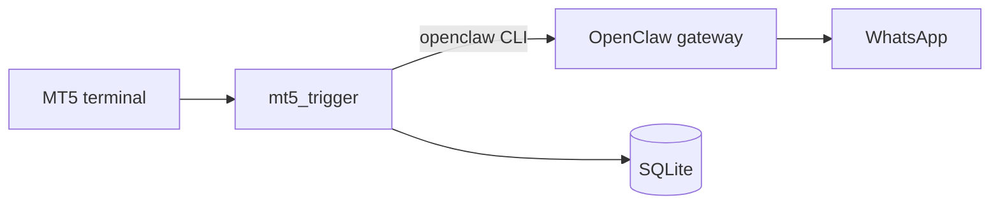

# MT5 Trigger Monitor

Monitor MetaTrader 5 investor (read-only) accounts for pending-order proximity, trade triggers, and position closes. Send WhatsApp alerts via [OpenClaw](https://documentation.openclaw.ai/cli/message).

## What you need

| Component | Purpose | Where it runs |
|---|---|---|
| **This app** (`mt5_trigger`) | Polls MT5, sends alerts, stores events | Your monitor machine |
| **MT5 terminal** | Broker connection (investor login) | Same machine **or** remote VPS via bridge |
| **OpenClaw gateway** | Delivers WhatsApp messages | **Same machine as this app** |
| **SQLite** | Event log + dedupe | Auto-created in `data/` (gitignored) |



> **Important:** OpenClaw must be installed and its gateway running on the **same machine** as `mt5_trigger`. MT5 can be on a different server (see [Remote MT5](#remote-mt5-windows-vps)).

---

## Setup guide

### Step 1 — Clone and install

```bash
cd mt5_trigger
make setup
```

This creates `.venv`, installs dependencies, and copies config templates:
- `.env.example` → `.env`
- `config/accounts.yaml.example` → `config/accounts.yaml`

**Platform-specific install** (if `make setup` isn't enough):

| OS | Command |
|---|---|
| Windows (production) | `make install-native` |
| macOS / Linux (bridge) | `make install-bridge` or `make install-dev` |
| Offline dev / tests | `make install-dev` (includes mock backend) |

---

### Step 2 — Configure credentials

Edit **`.env`** (never commit this file):

```env
# MT5 investor (read-only) credentials
MT5_LOGIN=501086912
MT5_PASSWORD=your_investor_password
MT5_SERVER=ValetaxGlobal-Live3

# WhatsApp recipient — E.164 phone or group JID
# Phone:  +15551234567
# Group:  120363123456789012@g.us
WHATSAPP_TARGET=+15551234567

# Backend: auto | native | bridge | mock
MT5_BACKEND=auto
```

Edit **`config/accounts.yaml`** (also gitignored). The default uses values from `.env`:

```yaml
accounts:
  - name: valetax_main
    login: "${MT5_LOGIN}"
    password: "${MT5_PASSWORD}"
    server: "ValetaxGlobal-Live3"
    enabled: true
    whatsapp_target: "${WHATSAPP_TARGET}"
    mt5_backend: auto
    bridge_host: localhost
    bridge_port: 18813
```

**Adding more accounts:** duplicate the block, change `name`, credentials, and use a **unique `bridge_port`** per MT5 terminal instance.

---

### Step 3 — Set up MT5

Pick **one** path for your OS.

#### Windows (recommended for 24/7)

1. Install [MetaTrader 5](https://www.metatrader5.com/)
2. Log in with your **investor (read-only) password** in the terminal
3. Run `make install-native` if not already done
4. Leave `mt5_backend: auto` (auto-detects native on Windows)

#### macOS / Linux (local bridge)

MetaTrader5's Python API is Windows-only. On Mac/Linux you run MT5 under Wine and connect via a bridge:

1. Install MT5 terminal (MT5.app on Mac, or Wine on Linux)
2. Log into your account in the terminal
3. Start the bridge (example with [mt5-mac-bridge](https://pypi.org/project/mt5-mac-bridge/)):
   ```bash
   mt5-mac-bridge serve   # listens on port 18813 by default
   ```
4. In `accounts.yaml` set:
   ```yaml
   mt5_backend: bridge
   bridge_host: localhost
   bridge_port: 18813
   ```

#### Remote MT5 (Windows VPS)

When MT5 runs on a **different machine** from this app:

1. On the **VPS**: MT5 terminal logged in + bridge server on port `18813`
2. On the **monitor machine**: point `bridge_host` at the VPS

```yaml
mt5_backend: bridge
bridge_host: "10.0.0.5"    # VPS IP
bridge_port: 18813
```

**SSH tunnel (safer — no public port):**

```bash
# Run on your monitor machine (keep this terminal open)
ssh -L 18813:127.0.0.1:18813 user@your-vps
```

Then use `bridge_host: localhost` in `accounts.yaml`. Traffic is encrypted; the bridge on the VPS can stay on `127.0.0.1` only.

---

### Step 4 — Set up OpenClaw (WhatsApp)

OpenClaw must run on the **same machine** as `mt5_trigger`. The app calls the `openclaw` CLI; the CLI talks to the local gateway.

1. **Install OpenClaw** — see [OpenClaw docs](https://documentation.openclaw.ai/)

2. **Link WhatsApp** (one-time):
   ```bash
   openclaw channels login --channel whatsapp
   ```

3. **Start the gateway** (keep running in a separate terminal):
   ```bash
   openclaw gateway
   ```
   Default: `http://localhost:18789` (configured in OpenClaw's own config, not in this app).

4. **Set the recipient** in `.env`:
   ```env
   WHATSAPP_TARGET=+15551234567
   ```

There is **no gateway URL env var in this project** — gateway settings live in OpenClaw's configuration (`~/.openclaw/`). This app only needs `WHATSAPP_TARGET` and `openclaw` on your `PATH`.

---

### Step 5 — Verify everything works

Run these **before** starting the full monitor:

```bash
# Terminal 1 — OpenClaw gateway (if not already running)
openclaw gateway

# Terminal 2 — tests
make test-whatsapp    # sends a test message to WHATSAPP_TARGET
make test-mt5         # connects to MT5, lists open positions
```

| Test | Pass means |
|---|---|
| `make test-whatsapp` | OpenClaw + WhatsApp delivery works |
| `make test-mt5` | MT5 login + position read works |
| `make test-mt5-mock` | App logic works without a real terminal |

Optional flags:
```bash
.venv/bin/python scripts/test_whatsapp.py --message "custom text"
.venv/bin/python scripts/test_mt5.py --account valetax_main --pending
```

---

### Step 6 — Run the monitor

```bash
# Production (real MT5 + WhatsApp)
make prod

# Development (mock MT5, no terminal needed)
make dev
```

Health check (while running):

```bash
make health
# or open http://localhost:8080/health
```

---

## Makefile reference

| Target | Description |
|---|---|
| `make help` | List all targets |
| `make setup` | Venv + deps + copy config templates |
| `make install-dev` | Dev install (mock + bridge) |
| `make install-native` | Windows: native MetaTrader5 |
| `make install-bridge` | Mac/Linux: bridge support |
| `make test` | Run WhatsApp + MT5 tests |
| `make test-whatsapp` | Send test WhatsApp message |
| `make test-mt5` | MT5 connection + positions |
| `make test-mt5-mock` | MT5 test without terminal |
| `make dev` | Run with `MT5_BACKEND=mock` |
| `make prod` | Run monitor (normal) |
| `make health` | Curl `/health` endpoint |

---

## Configuration reference

### Environment variables (`.env`)

| Variable | Required | Description |
|---|---|---|
| `MT5_LOGIN` | Yes | Account number |
| `MT5_PASSWORD` | Yes | **Investor** (read-only) password |
| `MT5_SERVER` | Yes | Broker server name |
| `WHATSAPP_TARGET` | Yes | E.164 phone (`+1...`) or group JID (`...@g.us`) |
| `MT5_BACKEND` | No | `auto` (default), `native`, `bridge`, or `mock` |
| `MT5_BRIDGE_HOST` | No | Default bridge host (per-account override in YAML) |
| `MT5_BRIDGE_PORT` | No | Default bridge port |

### Account settings (`config/accounts.yaml`)

| Field | Description |
|---|---|
| `name` | Unique label for this account |
| `login` / `password` / `server` | MT5 credentials (use `${ENV}` refs) |
| `enabled` | `true` to monitor, `false` to skip |
| `whatsapp_target` | Override recipient for this account |
| `mt5_backend` | `auto`, `native`, `bridge`, or `mock` |
| `bridge_host` | IP/hostname of MT5 bridge (`localhost` or VPS IP) |
| `bridge_port` | RPyC port (one per MT5 terminal) |
| `terminal_path` | Windows only: path to `terminal64.exe` |

### App settings (`config/settings.yaml`)

| Setting | Default | Description |
|---|---|---|
| `poll_interval_seconds` | `2` | How often to check MT5 |
| `health_port` | `8080` | Health endpoint port |
| `openclaw_bin` | `openclaw` | Path to OpenClaw CLI |
| `near_trigger.min_pips` | `12` | Min distance before near-trigger alert |
| `near_trigger.spread_multiplier` | `3` | Adaptive threshold vs spread |

---

## Alert types

| Event | Example |
|---|---|
| Near trigger | `GBPUSD pending BUY STOP at 1.26500 about to trigger (current 1.26488)` |
| Closed profit | `order 1.26500 closed at 1.26710, secured ✅ profit: $42.50` |
| Closed loss | `order 1.26500 closed at 1.26420, lost ❌ lost: $18.30` |
| Weekly summary | `we made 14 trades this week...` |

Near-trigger alerts are suppressed when the forex market is closed or in a rollover blackout (Sunday/Friday 17:00 ET ± buffer).

---

## Troubleshooting

### `make test-whatsapp` fails

- Is `openclaw gateway` running?
- Is WhatsApp linked? (`openclaw channels login --channel whatsapp`)
- Is `WHATSAPP_TARGET` correct? Use E.164 for DMs or full group JID for groups.
- Is `openclaw` on your PATH? Or set `openclaw_bin` in `config/settings.yaml`.

### `make test-mt5` fails

| Symptom | Fix |
|---|---|
| `login/password empty` | Set `MT5_LOGIN` and `MT5_PASSWORD` in `.env` |
| Windows: initialize failed | MT5 terminal must be running; use investor password |
| Mac/Linux: connection refused | Start MT5 + bridge; check `bridge_host` / `bridge_port` |
| Remote VPS | SSH tunnel or set `bridge_host` to VPS IP; ensure firewall allows port |

### No near-trigger alerts

- Market may be closed (weekend or rollover blackout)
- Price may not be within threshold yet (`min_pips` + spread logic)
- Each pending ticket alerts only once until price moves away and re-enters zone

---

## Security

- Never commit `.env` or `config/accounts.yaml`
- Use **investor (read-only) password** only — cannot place trades
- Do not expose RPyC bridge ports to the public internet; prefer SSH tunnel or VPN
- Rotate credentials if they were ever shared in plaintext

---

## Project layout

```
mt5_trigger/
├── .env                    # secrets (gitignored)
├── Makefile
├── config/
│   ├── settings.yaml       # app tuning
│   └── accounts.yaml       # MT5 accounts (gitignored)
├── data/                   # SQLite DB (gitignored)
├── scripts/
│   ├── test_whatsapp.py    # OpenClaw send test
│   └── test_mt5.py         # MT5 connection test
└── src/mt5_trigger/        # application code
```

## License

MIT
